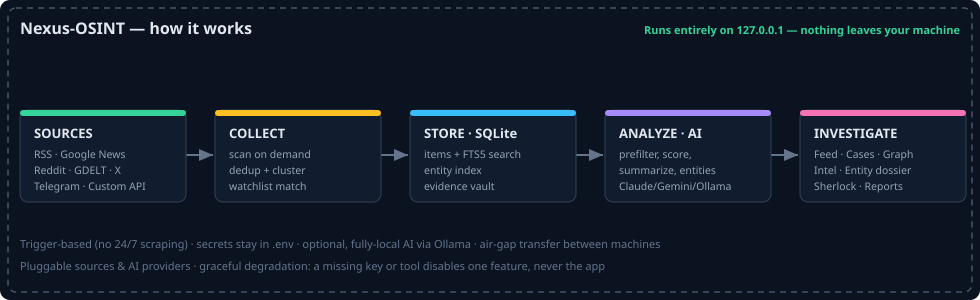

<div align="center">

# 🛰️ Nexus-OSINT

**A local-first open-source intelligence workstation — collect, analyze, and investigate, entirely on your own machine.**


**[User Guide](docs/USER_GUIDE.md)** · **[Developer Guide](docs/DEVELOPER_GUIDE.md)** · **[Roadmap](docs/ROADMAP.md)** · **[Security](SECURITY.md)**

</div>

---

A local-first, open-source intelligence platform for researchers, analysts, and
journalists. Nexus collects content from open sources, stores it locally in
SQLite, enriches it in real time with an AI backend (Claude, Gemini, ChatGPT, or
a fully local model via Ollama), and presents it in a unified, bilingual feed
with an analyst workspace — all on
`127.0.0.1`, nothing leaves your machine.

The guiding principle is **graceful degradation**: every source and capability
is optional. A missing API key disables exactly one source; with no AI key items
are stored without analysis. Nothing ever crashes for want of a key.

**It runs for free.** The core collection sources — RSS, Google News, and Reddit
search — need no API key at all (they use public RSS/Atom feeds), and Google
Gemini offers a free tier for the AI analysis. You can run a complete, useful
investigation without paying for anything; keyed sources (SERPAPI, Google Custom
Search, Twitter/X, Telegram) are optional upgrades you add only if you want them.

## Documentation

- **[Complete Project Explanation](OVERVIEW.md)** — the single in-depth overview of
  what the project is, how it works end to end, and how to run, use, and extend it.
- **[User Guide](docs/USER_GUIDE.md)** — a complete, plain-language manual: every
  page, the assistant, common workflows, keyboard shortcuts, and troubleshooting.
- **[Developer & Contributor Guide](docs/DEVELOPER_GUIDE.md)** — architecture, the
  scan pipeline, the data model, and how to add a source, a tool adapter, an AI
  provider, or an assistant action — plus how to build the desktop installer.
- **[Roadmap](docs/ROADMAP.md)** · **[Security policy](SECURITY.md)**

## Features

- **Investigate across all sources** — enter one term (a name, alias, handle,
  wallet, CVE, organisation) and it is searched on every keyword-capable source
  at once — Google News and Reddit (both keyless, via public search RSS), plus
  Google Custom Search, SERPAPI, Twitter/X, and Telegram when their keys are
  set — on each scan, with results landing in the unified feed and ranked in
  Intel. A configurable time window (`NEWS_WINDOW_DAYS`) bounds news to the last
  N days, keeping each scan fresh and its volume in check.
- **Add sources and keys from the dashboard** — manage collection targets on the
  Topics page and paste any API key on the Settings page; keys are written to
  `.env` only (never the database, never shown back) and take effect with no
  restart. No file editing required.
- **Add any JSON API as a source** — on the Sources page, plug in any public REST
  API without writing code. When an AI backend is connected it can read the API's
  docs and/or a sample response and auto-fill the configuration (base URL, auth,
  which field holds the text); with no AI you fill the same fields by hand. A
  per-source **Test** button does a live fetch so you can confirm it works before
  it joins the next scan. Each source's API key lives in `.env` only (the key name
  is derived server-side from the source id, so nothing arbitrary can be written).
- **Unified feed (The River)** — a dense, dark, terminal-style stream of items
  with threat badges, AI summaries, optional translation, and echo/virality
  counts for near-duplicate content.
- **AI intelligence core** — a local prefilter trims noise before any token is
  spent; items are then scored (threat level), summarized, translated, flagged
  for possible disinformation, and tagged first-party vs. third-party. The
  backend is pluggable (Anthropic Claude, Google Gemini, or OpenAI ChatGPT) and
  switchable live from Settings. Results are cached by content and capped per run by a budget
  guard.
- **Intelligence Requirements** — define the questions your investigation needs
  answered; the AI scores every collected item (0–100) for relevance to each
  requirement, and a dedicated Intel feed ranks items by how well they answer
  what you actually care about.
- **Full-text search & facets** — SQLite FTS5 across the whole local history,
  filtered by source, threat level, and date range.
- **Daily brief** — a one-screen morning read: what's new across every open case
  since you last looked at each, top items first, with one-click pin. Cases show
  a **"+N new"** badge, **mark-all-read** clears a case's queue, and the feed
  supports **keyboard triage** (`j/k` move, `o` open, `b` bookmark, `r` read). A
  set-up checklist surfaces any configuration gaps with one-click fixes.
- **Case hub** — a Case is the single home for one subject. Each case has tabs:
  a **Live feed** driven by its tracking words (its "word capsule" — also searched
  across your sources on each scan), a **Pinned** dossier of items + researcher
  notes, a **Questions** tab (per-case intelligence requirements with scored
  matches), and **sub-cases**. Create a case from a one-line brief and the AI sets
  up its tracking words and starter questions for you.
- **Evidence Vault** — timestamped, SHA-256-hashed full-page screenshots of a
  source at collection time, stored locally so they survive deletion upstream.
  Visible text in each screenshot is read by OCR (when the Tesseract engine is
  present — bundled in the Docker image) so image-only sources stay searchable.
- **Watchlists & alerts** — keyword / regex / wallet / phone patterns matched
  against new items on every scan.
- **Plug & Play OSINT tools** — wraps installed CLI tools (Sherlock, Maigret,
  holehe, GHunt, PhoneInfoga, theHarvester, SpiderFoot, Toutatis, OnionSearch)
  and pulls their findings into a local entity graph (a lightweight
  link-analysis alternative built on networkx + pyvis).
- **Custom API sources (self-service + self-healing)** — point Nexus at any
  public JSON API; the AI planner reads its docs/sample response and writes the
  field mapping for you. **Auto-Adapt** then watches each custom source: if the
  API keeps responding but its response shape drifts (so nothing is collected),
  the AI automatically re-maps the fields from the latest response — bounded by
  a threshold and a cooldown, and only when an AI provider is connected.
- **Reporting & data export** — export a case to PDF (or HTML) including items,
  AI summaries, evidence screenshots, and notes. Every data view also offers a
  one-click **Export** menu: PDF/HTML reports plus machine-readable **CSV and
  JSON** of exactly the rows you're looking at (filters and search applied) — on
  the main feed, the relevance-ranked Intel view (with each item's score), and
  inside a case. The Security center adds a downloadable data-handling audit
  report. A case also exports as an **Obsidian vault** (a Markdown folder with
  `[[wikilinks]]` to every entity) so Obsidian's graph view shows the case's web
  of people, organisations and places.
- **Relationship graph** — a co-occurrence network of the people, organisations
  and places the AI extracts: bigger dots are mentioned more, central dots
  connect the most others. Available globally **or scoped to a single case**
  (its tracked items only) from the case's **Graph** button.
- **Air-gap transfer** — move collected intelligence between two machines without
  a network (`/transfer`). An online collector exports a portable `.nexusbundle`
  file (everything, a single case, or just what's *new since the last export*) to
  a USB stick; an offline analysis station imports it and instantly sees every
  item with its summary, translation, entities, scores and evidence screenshots.
  Items are keyed on a stable content hash, so importing is idempotent and never
  collides with the receiving machine's own data. **No secrets ever travel in a
  bundle** — only collected open-source data and its analysis; `.env` and keys
  stay on each machine. Imported files are vetted by the security scanner first
  and written safely (evidence by basename only — no path traversal).
- **Sherlock, the in-app assistant** — a floating chat (bottom-right) backed by
  the same AI provider. It explains how to use the workstation, answers questions
  about your collected data, and can *act* on your behalf with plain-language
  requests: run a scan, search the feed, open a case and add the matching items,
  generate a report, capture evidence of an item, add a watchlist term, add an
  intelligence requirement, write a case note, or open a page. By design it only
  ever performs **constructive, local** actions — it cannot delete anything,
  change settings/keys/the AI provider, or send your data anywhere.
- **Security center** — a built-in, fully local defensive layer (`/security`):
  an **egress monitor** that records every outbound connection the app makes and
  flags any destination that isn't an AI provider, a configured source, or the
  local machine; and a **file scanner** for vetting files you bring in (disguised
  executables by real signature, zip-slip / zip-bomb archives, embedded
  installers, macro-bearing documents). ClamAV is used automatically if present,
  and — only if you opt in with `VIRUSTOTAL_API_KEY` — a file's SHA-256 *hash*
  (never the file itself) is checked against VirusTotal. That hash lookup is the
  only part that ever touches the network.

## Architecture



- **Backend:** Python 3.11 + FastAPI.
- **Storage:** a single SQLite database (WAL mode) with an FTS5 index kept in
  sync by triggers. No external database server.
- **Frontend:** Jinja2 + htmx + Tailwind (CDN) — no build step.
- **AI:** a pluggable backend (Anthropic Claude with prompt caching, Google
  Gemini, or OpenAI ChatGPT) fronted by a cheap local prefilter; chosen in
  `.env` and switchable live from Settings.
- **Execution is trigger-based** (no 24/7 scraping): a silent *Boot Sync* fills
  gaps at startup, and a *Manual Scan* button runs collection on demand.
- **OpSec:** the server binds to `127.0.0.1` only; secrets live in `.env` and
  never touch the database, the UI (set/not-set only), or the logs (a redaction
  filter scrubs any configured key from every log line).

```
nexus/
├── config.py            # .env settings + capability flags
├── db.py                # SQLite schema, WAL, FTS5
├── models.py            # RawItem / Analysis / ProcessedItem
├── storage.py           # all DB read/write helpers (dedup, search, workspace)
├── collector.py         # scan orchestration (sources -> store -> analyze)
├── sources/             # rss, freesearch (keyless Google News + Reddit),
│                        # google_cse, serpapi, reddit, twitter, telegram,
│                        # custom (generic config-driven JSON API source),
│                        # auto_adapt (AI re-maps a drifting custom source)
├── adapters/            # Plug & Play CLI wrappers + registry
├── analysis/            # prefilter, prompts, providers, claude_core,
│                        # requirements, source_planner (AI source auto-setup)
├── graph.py             # networkx + pyvis entity graph
├── evidence.py          # Playwright screenshot + hash
├── reporting.py         # case -> PDF/HTML
└── web/                 # FastAPI app + Jinja templates
```

## Quick start

You do **not** need to be a developer to run Nexus. The Docker route below is
the simplest: it installs everything (Python, the OSINT CLI tools, a headless
browser) inside one self-contained container, so the only thing you install by
hand is Docker itself.

### Docker (recommended)

**One-time prerequisite:** install **Docker Desktop** (free) from
<https://www.docker.com/products/docker-desktop/> — there's a build for Windows,
macOS, and Linux. Launch it once and wait until it says it's running.

Then, in a terminal opened **in this project's folder**:

```bash
cp .env.example .env      # creates your settings file (start empty — keys are optional)
                          # Windows: copy .env.example .env
docker compose up --build
```

The first build takes a few minutes (it downloads everything once). When you see
the server start, open **http://127.0.0.1:8000** in your browser. That's it.

The Docker image bundles the OSINT CLI tools and a headless Chromium for the
Evidence Vault, so every feature works out of the box.

To stop it, press `Ctrl+C` in that terminal (or `docker compose down`). To start
again later, just run `docker compose up` (no `--build` needed).

### One-click desktop app (optional, Windows & Linux)

Prefer a desktop icon over a terminal? The **`launcher/`** folder has a full
one-time installer for each OS — it sets up Python, installs dependencies,
generates the icon, and drops a **Nexus OSINT** icon on your Desktop:

- **Windows** — open `launcher/windows/` and double-click
  **`Install Nexus (Windows).bat`**.
- **Linux** — run `bash launcher/linux/install.sh` from the project folder.

Afterwards, just click the **Nexus OSINT** icon. It opens the app in its own
chromeless window (no address bar, no tabs — it looks like a native program),
auto-refreshes your topics with the latest results on every launch, and shuts
the local server down when you close the window. Everything stays on
127.0.0.1. See `launcher/README.txt` (and the per-OS READMEs) for details.

### Local (uvicorn) — for developers

```bash
python -m venv .venv && source .venv/bin/activate   # Windows: .venv\Scripts\activate
pip install -r requirements.txt
playwright install chromium-headless-shell           # optional, for evidence (small)
cp .env.example .env                                 # Windows: copy .env.example .env
uvicorn nexus.web.app:app --host 127.0.0.1 --port 8000
```

CLI tools (Sherlock, Maigret, etc.) and Chromium are auto-detected; anything not
installed is simply skipped.

### First steps once it's running

1. Open **http://127.0.0.1:8000** — a built-in onboarding wizard greets you on
   first run, and the **Guide** page (top menu) explains every concept in plain
   language.
2. *(Optional)* On **Settings**, paste any API keys you have, or pick a free
   local AI model (Ollama) — see the Guide for a no-terminal walkthrough. With no
   keys at all, Nexus still works on free RSS + Google News + Reddit search.
3. On **Topics**, name a subject and list the terms you care about (or click a
   one-click bundle), then press **Run a scan**. Collected items appear in the
   Feed within seconds.

### If something goes wrong

- **The page won't open / "connection refused"** — give the first `docker compose
  up --build` a minute to finish building, then refresh. Confirm Docker Desktop
  is running.
- **A scan finds nothing** — make sure you added at least one topic on **Topics**
  first; without topics there's nothing to search for.
- **No AI summaries/translation** — that's expected until you connect an AI
  provider on **Settings** (cloud key or local Ollama). Collection and search
  work regardless.
- Nothing here ever crashes for a missing key or tool — a missing piece just
  disables that one feature (graceful degradation).

## Configuration

All configuration lives in `.env` (see `.env.example` for the full list).
Everything is optional:

| Variable | Enables | Key? |
| --- | --- | --- |
| *(capsule search terms)* | Keyless Google News + Reddit search | **free** |
| `RSS_FEEDS` | RSS collection | **free** |
| `NEWS_WINDOW_DAYS` | Time window for keyless Google News (default 7) | **free** |
| `AI_PROVIDER` | Chooses the AI backend: `anthropic`, `gemini`, `openai`, `ollama`, or `off` | — |
| `GEMINI_API_KEY` | Gemini analysis, translation, threat scoring | free tier |
| `ANTHROPIC_API_KEY` | Claude analysis, translation, threat scoring | paid |
| `OPENAI_API_KEY` | ChatGPT analysis, translation, threat scoring | paid |
| `LIBRETRANSLATE_URL` | Keyless English-translation fallback when no AI is set | **free** |
| `GOOGLE_CSE_KEY` + `GOOGLE_CSE_CX` | Google Custom Search (wider web) | free tier |
| `SERPAPI_KEY` + `SERPAPI_QUERIES` | Richer Google News via SERPAPI | paid |
| `REDDIT_CLIENT_ID/SECRET` + `REDDIT_SUBREDDITS` | Reddit subreddit "new" feeds | free |
| `TWITTER_BEARER_TOKEN` + `TWITTER_QUERIES` | Twitter/X collection | paid |
| `TELEMETRY_API_KEY` + `TELEGRAM_CHANNELS` | Telegram collection | paid |
| `INSTAGRAM_SESSIONID` | Toutatis adapter (Instagram account lookup) | free |
| `VIRUSTOTAL_API_KEY` | Security center: hash-only VirusTotal lookup (opt-in) | free tier |
| `ANALYSIS_MAX_ITEMS_PER_RUN` | Budget guard: items analyzed per scan (default 100) | — |

Secrets are read from `.env` only and are never written to the database — and a
log-redaction filter scrubs any configured key from the logs as a safety net.
Keys can be pasted on the Settings page (saved to `.env`, never shown back), and
the AI provider can be switched live there too (the choice is stored in the
database, but the keys themselves always stay in `.env`). If the AI provider
hits its rate/quota limit (e.g. Gemini's free tier) the scan pauses cleanly and
the remaining items are analyzed on the next run.

## Run a fully local model (no cloud, no data leaves your machine)

Some organisations cannot send investigation content to a third-party cloud API
(Google, Anthropic, OpenAI) for data-security or compliance reasons. Nexus
supports a **fully local** AI backend via [Ollama](https://ollama.com): the model
runs on your own machine, so analysed content **never leaves it**. No API key,
no account, no network calls to anyone.

### Setup

1. **Install Ollama** — download it for Windows, macOS, or Linux from
   <https://ollama.com/download> (on Linux: `curl -fsSL https://ollama.com/install.sh | sh`).
   It runs a local server at `http://localhost:11434` automatically.
2. **Pull a model** — in a terminal:
   ```bash
   ollama pull gemma4:e4b      # the default; ~4 GB download
   ```
3. **Point Nexus at it** — set `AI_PROVIDER=ollama` in `.env` (and optionally
   `OLLAMA_MODEL` / `OLLAMA_BASE_URL`), **or** just pick **"Local model (Ollama)"**
   from the AI-provider dropdown on the Settings page. That's it — scans now
   analyse everything locally.

If the Ollama server isn't running, analysis simply pauses for that scan
(graceful degradation) — collection and search keep working, and analysis
resumes automatically once Ollama is back.

### Hardware requirements

Pick a model to match your hardware. CPU-only works everywhere but is slower; a
GPU (NVIDIA, or Apple-Silicon unified memory) makes analysis much faster.

| Use case | Model | RAM (CPU-only) | GPU VRAM (fast) | Disk |
| --- | --- | --- | --- | --- |
| Lightweight / older laptops | `gemma4:e2b` | 8 GB | 4 GB | ~2 GB |
| **Recommended balance** | `gemma4:e4b` *(default)* | 16 GB | 8 GB | ~4 GB |
| Higher quality | `gemma4:12b` / `gemma4:26b` | 32 GB | 24 GB | ~9–18 GB |
| Best (workstation/server) | `gemma4:31b` | 64 GB+ | 24 GB+ | ~22 GB |

Notes:
- **Apple-Silicon Macs** (M-series) run these models well thanks to unified memory.
- The cheap local **prefilter** and the **budget guard**
  (`ANALYSIS_MAX_ITEMS_PER_RUN`) keep the workload manageable on modest hardware —
  lower the cap if a scan is too heavy for your machine.
- **Quality trade-off:** an 8B local model gives solid summaries and threat
  scoring; the cloud models are still stronger for the most nuanced analysis.
  Choose the trade-off that fits your security posture — you can switch backends
  any time from the Settings page.

## How a scan works

1. **Collect** — each available source fetches new items.
2. **Deduplicate** — exact re-fetches are ignored; near-duplicates collapse into
   one feed row with an "Echoed N times" badge.
3. **Watchlists** — new items are matched against your patterns, recording alerts.
4. **Analyze** — un-analyzed items pass the local prefilter, then the active AI
   backend (within the per-run budget); results are cached so re-scans never
   re-pay.
5. **Score requirements** — each item is scored for relevance against your
   defined Intelligence Requirements, feeding the ranked Intel feed. Scores are
   cached per (item, requirement) pair.

## License

Open source. Bring your own API keys.
