<div align="center">

# Nexus-OSINT

**A local-first OSINT workstation: collect open sources, enrich them with AI, and triage everything in one private, auditable feed on your own machine.**

[](https://github.com/dorrachmani-dotcom/nexus-osint/actions/workflows/ci.yml)
[](LICENSE)


[Quickstart](#quickstart) · [Tour](#a-guided-tour) · [Features](docs/FEATURES.md) · [Overview](docs/OVERVIEW.md) · [User Guide](docs/USER_GUIDE.md) · [Developer Guide](docs/DEVELOPER_GUIDE.md) · [Roadmap](docs/ROADMAP.md) · [Security](SECURITY.md)

</div>

<p align="center">
  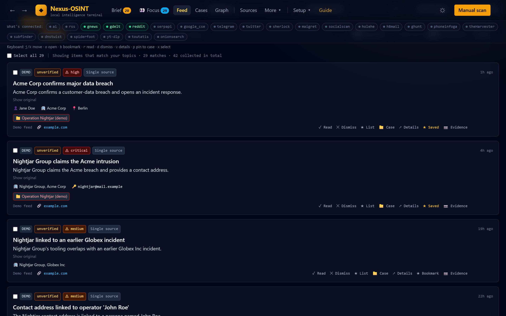
</p>
<p align="center"><sub>All screenshots use the built-in, entirely fictional demo dataset (the <b>Load demo data</b> button on the empty feed).</sub></p>

## The problem

Open-source material is scattered across news feeds, social platforms, search
engines and one-off CLI tools. An analyst ends up with forty tabs, no memory of
what was already seen, and no record of where a claim came from. Hosted
platforms solve the aggregation but want your queries and your findings on their
servers, which is a non-starter for a lot of investigative work.

Nexus-OSINT is the opposite trade: everything runs on `127.0.0.1`, the data is
one SQLite file you own, and every outbound connection can be audited.

## What it does

- **Collects** from RSS, Google News, Reddit and GDELT with no API keys, plus
  optional Twitter/X, Telegram, SERPAPI and Google CSE, any user-defined JSON API,
  and wrapped OSINT CLI tools.
- **Deduplicates and searches**: exact re-fetches are no-ops, near-duplicates
  collapse into one row with an "echoed N times" badge, and the whole history is
  searchable through SQLite FTS5.
- **Enriches** items with a pluggable AI provider (Gemini, OpenAI, Anthropic,
  xAI Grok, or a fully local model via Ollama or any OpenAI-compatible server
  such as LM Studio, llama.cpp, vLLM, Jan or LocalAI; "Automatic" picks the first
  one that is ready): summary, translation, threat level, entity extraction, and
  0-100 relevance scores against your standing questions.
- **Briefs you by email** (opt-in): once a day Sherlock writes a short analyst
  brief of what is new in your open cases and sends it through Gmail, Outlook,
  Resend, SendGrid or any SMTP server; per-case daily reports are saved locally
  as PDF/HTML and listed on each case's Reports tab.
- **Organizes** work into cases with tracking terms, pinned items, notes,
  sub-cases, a daily brief, watchlists and a "Focus" view of the few items that
  most need attention.
- **Preserves and exports**: hashed, timestamped page screenshots (Evidence
  Vault), PDF/HTML/CSV/JSON/Obsidian exports, and an air-gap bundle format for
  moving data between machines.
- **Archives sources on the Wayback Machine** (opt-in per action): request a
  public Internet Archive capture of an item's page, or look up its newest
  snapshot, as independent proof the page existed even if it is later deleted.
  Captures run on a polite, rate-limited background queue and their links land
  in the evidence manifest and case reports.
- **Audits itself**: an egress monitor records every outbound connection and a
  file scanner vets anything you import.

The full catalogue is in [docs/FEATURES.md](docs/FEATURES.md).

## Quickstart

**From source** (Python 3.11+):

```bash
python -m venv .venv && source .venv/bin/activate   # Windows: .venv\Scripts\activate
pip install -r requirements.txt
playwright install chromium-headless-shell           # optional, for the Evidence Vault
cp .env.example .env                                 # Windows: copy .env.example .env
uvicorn nexus.web.app:app --host 127.0.0.1 --port 8000
```

Open <http://127.0.0.1:8000>. Missing CLI tools and API keys are skipped, not fatal.

**Docker** (bundles the OSINT CLI tools and headless Chromium):

```bash
cp .env.example .env
docker compose up --build
```

**Windows installer**: download the latest installer from the repository's
**Releases** page and run it; it installs a desktop shortcut that opens the app in
its own window and stops the local server when closed. Linux has a script under
`launcher/linux/`.

On first run an onboarding wizard walks through adding topics and (optionally) an
AI provider.

## A guided tour

Each screen below exists because of a specific analyst problem. The notes say
what you are looking at and why it was built that way.

### 1. Focus: "what needs my eyes right now?"

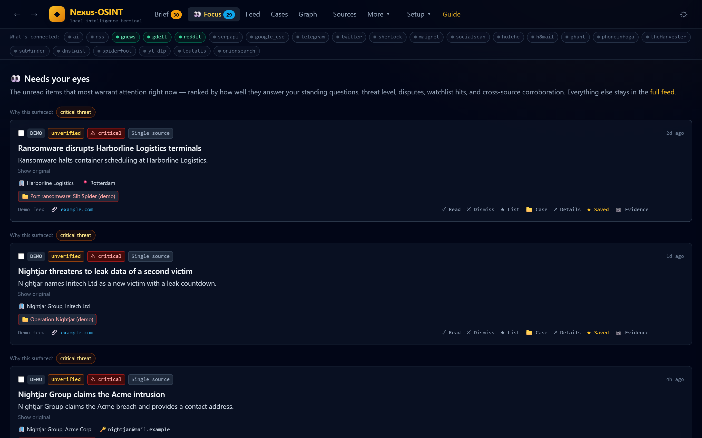

A scan can return hundreds of items, and an analyst cannot read them all. Focus
ranks the **unread** items by threat level, how well they answer your standing
questions, watchlist hits, disputes and cross-source corroboration. Every card
also states **why it surfaced**, so you can trust the ranking or disagree with
it. Nothing is hidden: everything else is still in the full feed.

### 2. The feed and the item drawer

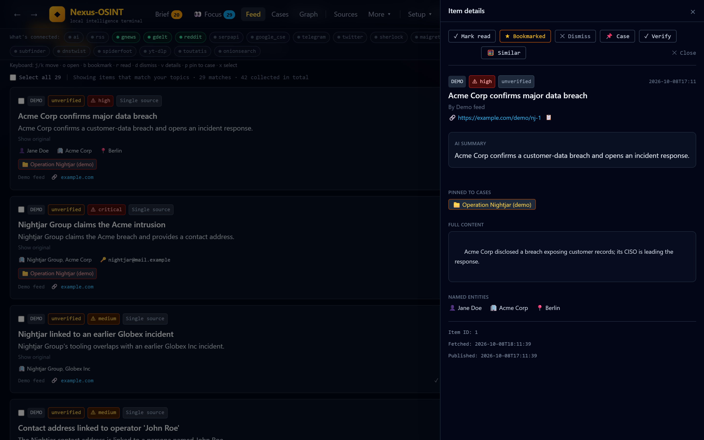

Each card carries a threat badge, a **verification state** (unverified until
corroborated), the AI summary in English, the original text one click away, and
the extracted people, organisations, places and identifiers. Opening an item
shows the full record plus actions: pin it to a case, **Verify** (finds independent
items about the same entities and asks the AI whether they corroborate or
contradict the claim) or **Similar** (local embedding search).
Summaries are labelled as AI output and the source link is always shown, because
an analyst has to be able to check the original. Threat levels and the 0-100
relevance scores are **model estimates, not calibrated probabilities**: they
order the reading queue, they do not replace judgement, which is also why every
item starts as *unverified* until other sources corroborate it.

### 3. Cases: an investigation, not a folder

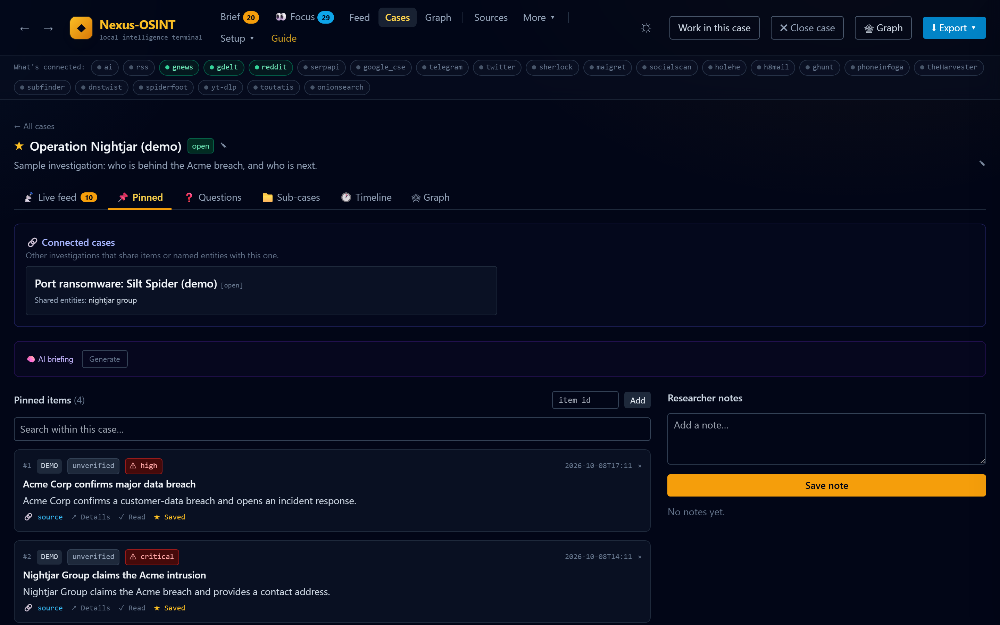

A case has tracking words that pull matching items into a live feed, pinned
evidence, standing questions, sub-cases, notes and a one-click AI briefing.
**Connected cases** appears automatically: here, Operation Nightjar is linked to
the Silt Spider ransomware case because both mention Nightjar Group. That cross-case
link is computed from the `item_entities` index, not stored by hand.

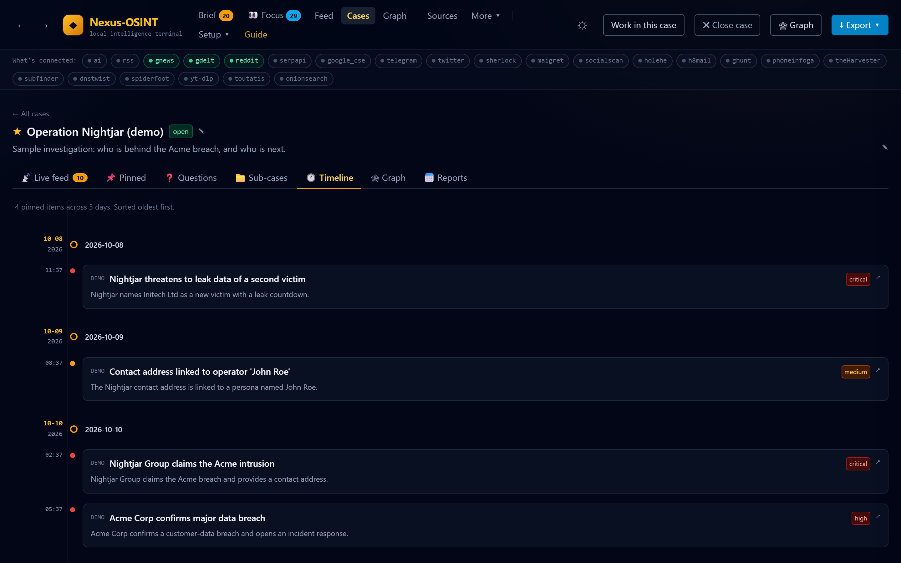

The timeline puts pinned evidence in order, which is usually the first thing a
reviewer asks for. Cases export to PDF/HTML, an Obsidian vault, or a hashed
evidence manifest.

### 4. Relationship graph

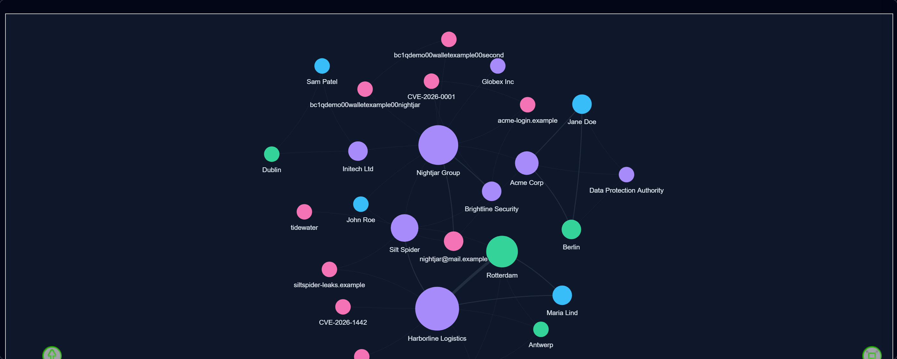

Two cases are selected here, and the graph shows the shared actor in the middle:
Nightjar Group links the Acme breach to the Harborline ransomware via shared
tooling. Node size is how often an entity is mentioned; edges are co-mentions.
Colours separate people, organisations, places and identifiers (wallets,
domains, CVEs, emails), so infrastructure reuse stands out. Every node opens
that entity's dossier.

<details>
<summary><b>More of the tour: entity dossier, daily brief, the assistant, settings</b></summary>

#### 5. Entity dossier and contextual pivots

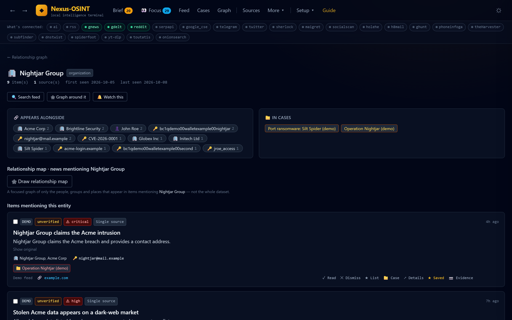

Everything known about one name on one page: first and last seen, the entities
it appears alongside, the cases it belongs to, and every item that mentions it.
When the entity is an identifier (email, username, phone, domain), the dossier
offers the matching **passive** OSINT tools (for example holehe for an email,
maigret for a username) as one-click pivots. Only tools that are installed are
offered, and targets are validated before they reach a subprocess.

#### 6. Daily brief

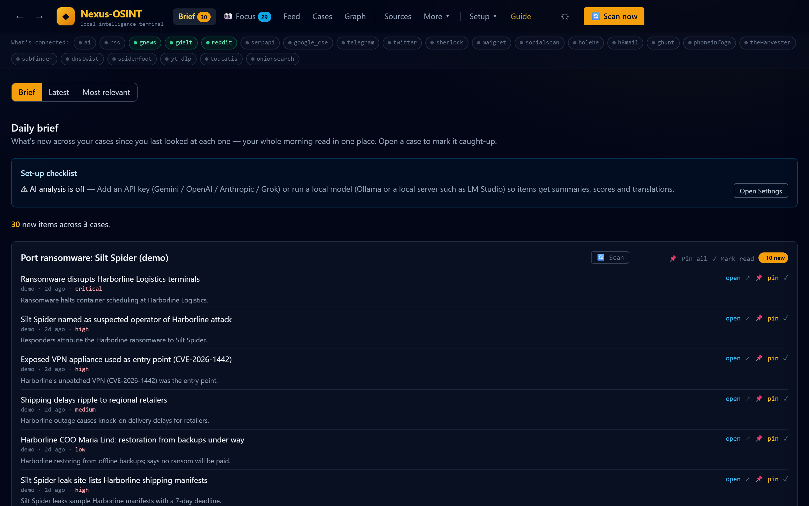

The morning read: what is new in each case since you last opened it. The set-up
checklist at the top says, in plain language, what is not configured yet (here,
AI analysis is off) instead of failing silently. Optionally, Sherlock emails a
written version of this brief every morning, and each case can save a daily
PDF/HTML report that shows up in a "Latest reports" strip here.

#### 7. Sherlock: an assistant that can act, inside a fence

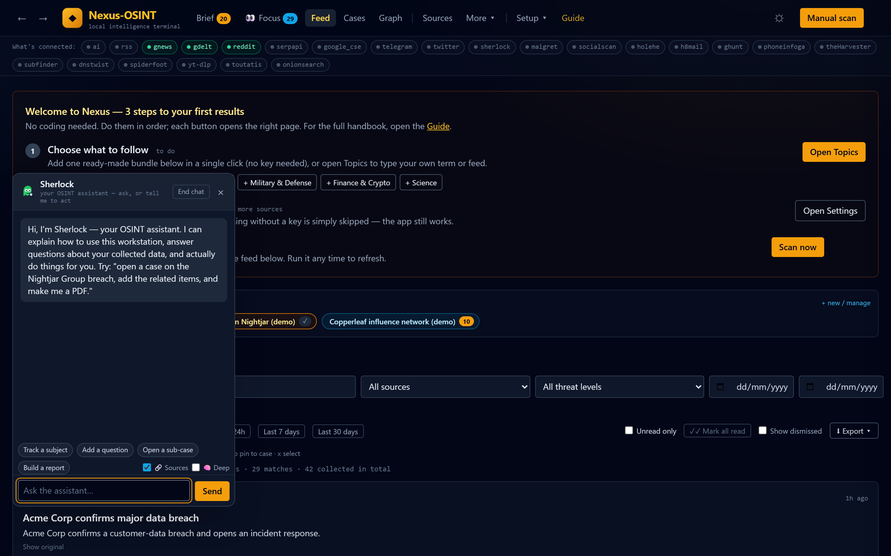

Sherlock, the in-app assistant (not the `sherlock` username CLI of the same
name), can open cases, add tracking words, pin matching items, run a scan and
build reports for you. It does that only through an **allow-list** of constructive,
local actions; it has no tool to delete data, change settings, read keys or
reach the network. Collected text is untrusted input, so the assistant's output
is rendered as text, never HTML: a prompt injection hidden in a scraped post
cannot become script execution in your browser.

#### 8. Settings that explain themselves

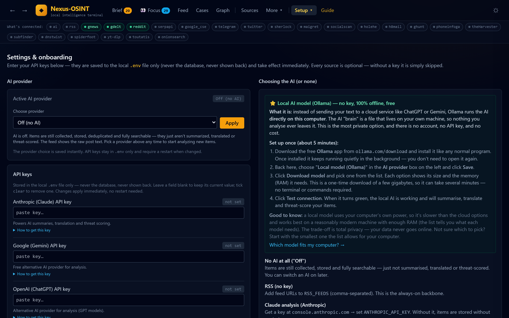

Pick an AI provider (cloud or a fully local model), paste keys, and configure
sources. Keys are written to the local `.env` only and are never shown back:
the UI only says *set* or *not set*. Each key has step-by-step instructions for
non-technical users.

<details>
<summary>Light theme</summary>

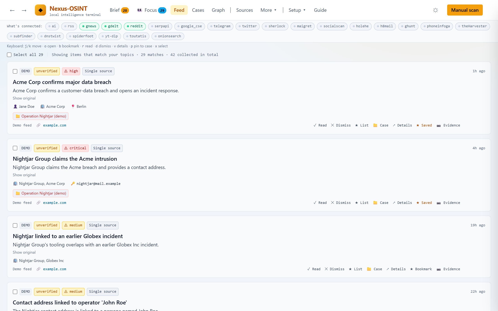

</details>

</details>

### Try the same demo yourself

After installing, click **Load demo data** on the empty feed. It inserts 42 fictional
items across three storylines (a data breach, port ransomware and a
disinformation network) and three cases, all tagged `demo` so they are easy to
delete. The screenshots are regenerated by
[`scripts/capture_screenshots.py`](scripts/capture_screenshots.py).

## Architecture


A scan runs collect -> deduplicate -> watchlist match -> AI analysis -> requirement
scoring. All SQL lives in `nexus/storage.py`; the UI is server-rendered Jinja2 +
htmx with no JavaScript build step. See [docs/OVERVIEW.md](docs/OVERVIEW.md) for
the end-to-end walk-through and [docs/DEVELOPER_GUIDE.md](docs/DEVELOPER_GUIDE.md)
for the module map and extension points.

## Engineering decisions and trade-offs

- **SQLite (WAL) + FTS5 instead of a database server.** One user, one machine,
  read-heavy workload: a single file gives atomic writes, trigger-maintained
  full-text search, trivial backup and zero install friction. The cost is a
  single writer and no multi-user access; collaboration is explicitly out of
  scope for now (see the roadmap).
- **Trigger-based collection instead of a 24/7 daemon.** Scans run on demand, from
  an optional timer, or as a quiet gap-fill at startup. Nothing polls in the
  background, which keeps the resource footprint and the outbound-traffic surface
  small and predictable. The cost is that data is only as fresh as the last scan.
- **Graceful degradation as a rule.** Every source, tool and AI provider is
  optional and reports `is_available()`. A missing key or binary disables exactly
  one feature; with no AI configured, items are still collected, stored and
  searchable. A per-run budget cap and content-hash caching bound AI cost, and
  quota errors pause a scan instead of failing it.
- **AI agent safety by allow-list.** The in-app Sherlock can act on your
  data, but only through a fixed set of constructive local tools
  (`_ALLOWED_TOOLS` in `nexus/assistant.py`), with a hard cap on actions per turn.
  Anything else the model asks for is dropped and logged. It has no delete,
  settings, key or network tools. Model output and collected text are rendered as
  text, never HTML, because collected content is untrusted input and a prompt
  injection must not be able to become script execution.
- **A real entity index.** Entities extracted by the AI are stored as JSON on the
  analysis row *and* normalized into an `item_entities` table (indexed by
  canonical name, backfilled on upgrade). This turns "everything mentioning X"
  from a full scan into an index lookup and backs the entity dossier, the
  relationship graph and cross-linking.
- **Safe script embedding.** Where data must be embedded in an inline `<script>`,
  it goes through Jinja's `|tojson`, which escapes `<`, `>` and `&`. An earlier
  `json.dumps | safe` path allowed a `</script>` in a collected title to break
  out; it was fixed and is the pattern to follow.

## What went wrong along the way (and the fix)

Short notes from building it, because the failures shaped the design more than
the plan did.

| Problem found | Root cause | Fix |
|---|---|---|
| A collected headline containing `</script>` could break out of the AI-briefing page. | Item data was embedded with `json.dumps(...) \| safe`, which does not escape `<`. | Switched to Jinja's `\|tojson` and added a regression test. Model output is rendered with `textContent` only. |
| Gemini "flash" replies came back empty or cut off mid-JSON. | Newer models spend output tokens on internal reasoning before writing anything visible. | A bounded thinking budget is added *on top of* the requested output length, so the answer always keeps its room. |
| The same story syndicated by 30 outlets flooded the feed. | Exact-URL dedup misses rewrites and tracking parameters. | Items get an aggressively normalised `dedup_key`; near-duplicates collapse into one row with an "echoed N times" badge. |
| "Everything mentioning X" got slow as the database grew. | Entities lived only as JSON on each analysis row. | A normalised `item_entities` table indexed by canonical name, backfilled on upgrade. It now powers dossiers, the graph and connected cases. |
| An AI assistant that can "do things" is a prompt-injection target. | Collected posts are attacker-controlled text that reaches the model. | A hard allow-list of constructive local actions, a per-turn action cap, and text-only rendering. Unknown tool calls are dropped and logged. |

## Responsible use

Nexus-OSINT is built for defensive research, journalism and due diligence on
**publicly available** information.

- **Passive only.** Pivots run passive lookup tools (for example holehe or
  maigret) against identifiers you already have. Nothing logs in, brute-forces,
  scans hosts or touches non-public systems, and the assistant has no tool that
  could.
- **Respect platform terms.** Social sources use official APIs with your own
  keys; there is no scraping of logged-in content and no account automation.
  Check the terms of X, Telegram, Reddit and any API you connect.
- **Follow the law where you work.** Searching for people can fall under privacy
  and data-protection law (for example GDPR). Have a lawful basis, collect only
  what the investigation needs, and delete what you no longer need.
- **Do not use it to stalk, harass or target individuals.** That is not a
  supported use, and pull requests that add offensive capability will not be
  accepted.
- **Archiving is public.** A Wayback Machine capture tells the Internet Archive
  which URL you are interested in and creates a snapshot anyone can find. Use it
  for material you are content to point at publicly; for sensitive work, keep to
  the local Evidence Vault screenshot.

## Security model

- The server binds to `127.0.0.1` only. Requests get CSRF/DNS-rebinding checks and
  security headers; user-supplied URLs pass an SSRF guard before being fetched.
- **Collected data stays on your machine unless you configure a cloud AI
  provider.** In that case the text of items being analyzed is sent to that
  provider. Cloud AI providers (Gemini, OpenAI, Anthropic, Grok) are explicit
  opt-ins: nothing is sent until you add a key. Choose a local model (Ollama or a
  local OpenAI-compatible server such as LM Studio), or no AI, to keep analysis
  fully offline. Collection itself necessarily contacts the sources you enable.
- **The daily email brief is an explicit opt-in that sends data off the
  machine**: titles, summaries and links of new items go to the mail service you
  connect (your SMTP server, Resend or SendGrid), and only after a successful
  test email. App passwords and API keys only, no OAuth. The per-case daily
  reports themselves stay on disk and are served only on `127.0.0.1`.
- Reports and transfer bundles leave the machine only when you export them, and
  bundles never contain secrets.
- **Internet Archive captures are an explicit, per-action opt-in** (a one-time
  warning explains the trade-off): the item's URL is sent to archive.org and the
  resulting snapshot is public. Auto-archiving on pin is off unless you enable
  it for a case, and the whole feature can be switched off in Settings.
- Secrets live in `.env` only (git-ignored). They are never written to the
  database, shown back in the UI, or emitted in logs (a redaction filter scrubs
  configured keys).
- **Works fully offline.** The stylesheet, htmx and the graph library ship
  with the app; the UI makes no CDN or font requests, and the
  Content-Security-Policy only allows the app's own origin. A test asserts that
  no page loads a remote asset.
- The Security center lists every outbound destination the app has contacted and
  flags any that is not a configured source or AI provider.

Reporting vulnerabilities and the full policy: [SECURITY.md](SECURITY.md).

## Testing and CI

```bash
pip install -r requirements-dev.txt
python -m pytest -q
```

The suite (about 500 tests) uses temporary SQLite databases and avoids the
network; it covers storage and dedup, source parsing, the assistant allow-list,
web hardening, export/transfer round-trips and route smoke tests.

GitHub Actions (`.github/workflows/ci.yml`) gates every push to `main` and every
pull request on:

- **test**: the suite on Python 3.11 and 3.12;
- **lint**: `ruff check .` (rule set and justified ignores in `pyproject.toml`);
- **types**: `mypy` over the `nexus` package;
- **assets**: rebuilds the Tailwind stylesheet and vendored htmx and fails if
  the committed copies have drifted.

Run the same checks locally with `ruff check .` and `mypy`, or install the git
hooks with `pre-commit install`. Dependabot proposes weekly updates for pip,
npm and GitHub Actions.
Contribution guidelines are in [CONTRIBUTING.md](CONTRIBUTING.md).

## Roadmap

See [docs/ROADMAP.md](docs/ROADMAP.md): pivots on graph nodes and in the item
drawer, configurable triage thresholds, richer entity resolution, and
lint/type-check gates in CI.

## About the author

Built by **Dor Rachmani** — [GitHub](https://github.com/dorrachmani-dotcom).

Available for consulting on OSINT tooling and AI-agent systems (local-first
architectures, agent safety, LLM-backed data pipelines).

## License

[MIT](LICENSE)
